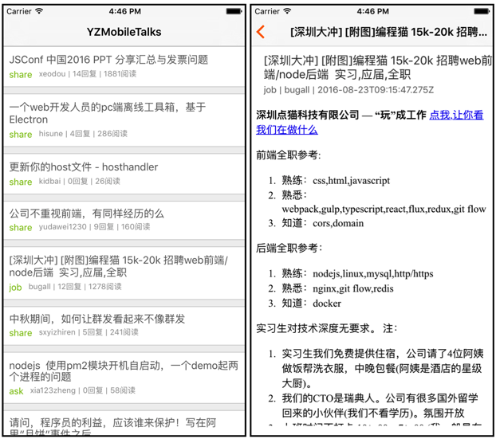

## YZRNDemo
育知同创春哥RN直播课程案例

#### 本项目是CNode-React-Native项目的升级版，原项目版本太老，所以春哥花点时间重构了一下，分享出来供大家学习使用，有技术问题，可以加我QQ：939442932一起交流学习。

#### 项目效果图

#### 1、为什么打造“YZMobileTalks团队”？
答：赠人玫瑰，手留余香，我们希望将我们Team研究的一些技术分享给大家。

#### 2、“YZMobileTalks团队”由哪些成员组成？
答：我们Team是来自育知同创iOS教学部，Team组成员由黎跃春、郑建文、郭宪龙、李瑞琦、孙长凯组成，我们会坚持每周更新五篇博客，用罗胖的话说就是：死磕自己，娱乐他人。

#### 3、微信公众号？
 

#### 4、技术交流QQ群？
ObjC:343640780      Swift:172090834    ReactNative:555705178

#### 5、”YZMobileTalks团队”Github地址？
https://github.com/YZMobileTalks

#### 6、”YZMobileTalks团队”新浪微博？
http://weibo.com/mobiledevelopment

